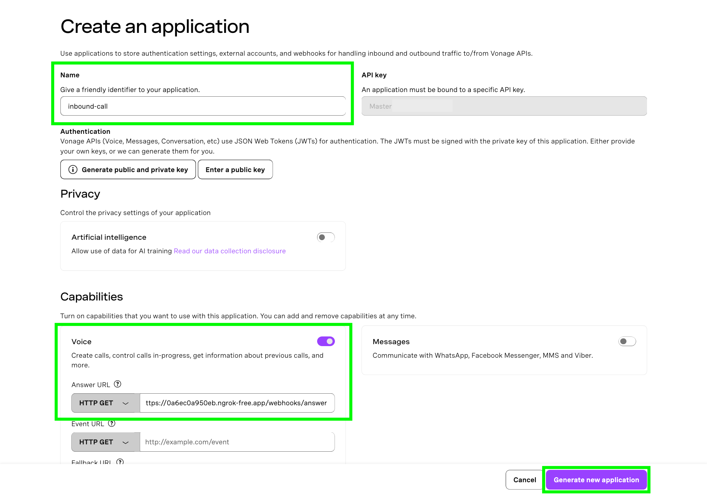
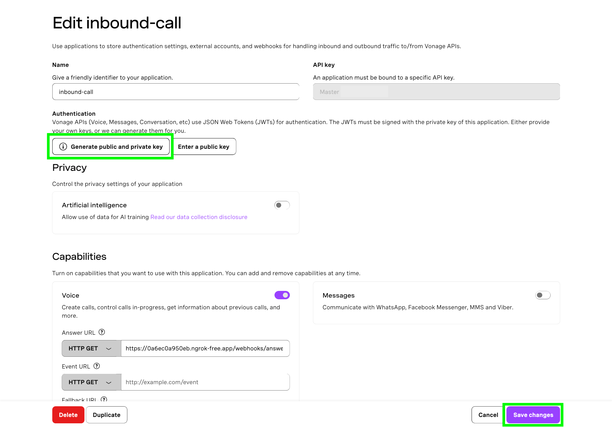
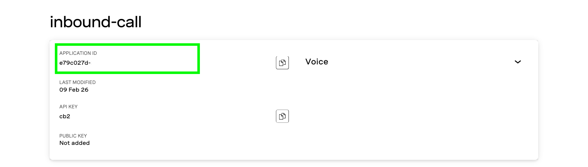
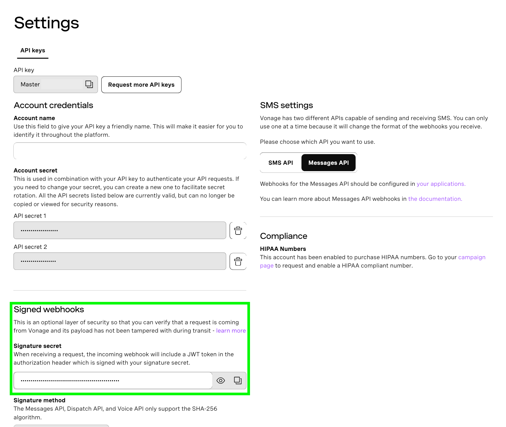

# Customer Service Call Flow Application

A minimal Python application demonstrating best practices for customer service call flows using FastAPI and Vonage APIs. It uses a SQLite database to simulate a CRM used for call personalization and interaction logging.

## Features

- **Effective IVR System**: Self-service menu options with escape routes for complex calls
- **Voice Quality**: Text-to-speech using Vonage Voice API with a voice that is styled to sound more natural
- **CRM Integration**: Customer lookup and personalized greetings based on previous interactions
- **Skills-Based Routing**: DTMF input routes calls to appropriate departments
- **Error Handling**: Graceful fallbacks and callback options when agents are unavailable
- **Interaction Logging**: All calls and messages recorded in SQLite database

# How To Get This Code Running

## Prerequisites
- Python 3.8+
- A [Vonage API account](https://vonage.dev/4dtSoCc)
- An [ngrok account and installation](https://developer.vonage.com/en/blog/local-development-nexmo-ngrok-tunnel-dr/)

## Setup

### Create an account with ngrok and install it
The Voice API must be able to access your webhook so that it can make requests to it, therefore, the endpoint URL must be accessible over the public internet.

In order to do that for this tutorial, we will use [ngrok](https://ngrok.com/). Check out our [ngrok tutorial](https://developer.vonage.com/en/blog/local-development-nexmo-ngrok-tunnel-dr/) to learn how to install and use it.

### Spin up an ngrok tunnel

In a separate terminal window, run:

```
ngrok http 3000
```

This command will generate the public URLs your local server will tunnel to on port 3000. Take note of the public URL – it should look something like this:

```bash
Forwarding                	https://some-public-url.ngrok-free.app -> http://localhost:3000
```

### Create a Vonage account and purchase a number

You will need a [Vonage API account](https://vonage.dev/4dtSoCc) and a virtual phone number. You can purchase a number from the [developer dashboard](https://dashboard.vonage.com/numbers/buy-numbers). Make sure to buy a number in your country code and with the appropriate features.

### Create a Voice API application and link your number to it

Create your Voice API application in the [developer dashboard](https://dashboard.vonage.com/applications) by navigating to the **Applications** window from the left hand menu and clicking the “Create new application” button. This will open the application creation menu. Give your application a human-friendly name like `vonage-hello-world`.

Under the **Capabilities** section, toggle the option for **Voice**, which will reveal a list of text fields. In the text field labeled **Answer URL**, provide the ngrok public URL amended with the webhook defined in the FastAPI app. This will look something like: `https://some-public-url.ngrok-free.app/webhooks/answer`.

Click the “Generate new application” button.



Now that your application has been created, you can link your number to it by clicking on the **Link** button in the table of available numbers. Your application is now ready to answer inbound calls.

## Run the code

### 1. Create and activate a Python virtual environment

```
virtuanlenv venv && source venv/bin/activate
```
### 2. Install dependencies
```
pip install -r requirements.txt
```
### 3. Obtain all your Vonage secrets

In the developer dashboard [Applications menu](https://dashboard.vonage.com/applications), click on your application and then click **Edit**. Once the edit window opens, click on the button that says, “Generate public and private key”. This will trigger a download of your private key as a file with the extension `.key`. **Keep this file private and do not share it anywhere it could be compromised.**

Click on the "Save changes button" and also note your Application ID.





Vonage uses [signed webhooks](https://vonage.dev/4bvezp1) to include a JWT in the authorization header of certain requests. You can find your signature secret in the Vonage developer dashboard in the [settings menu](https://dashboard.vonage.com/settings) under **Signed webhooks**.
 


### 3. Configure your environment variables

Move your private key file to your project directory and configure the variables in the `.env_template` file accordingly:

| Variable name           | Variable value                                                                              |
|-------------------------|---------------------------------------------------------------------------------------------|
| VONAGE_API_SECRET       | This can be found in the Vonage developer dashboard under  **API Settings**                 |
| VONAGE_API_KEY          | This can be found in the settings of the Voice application you created for this sample code |
| VONAGE_APPLICATION_ID   | This is the Vonage-generated ID of the Voice application you created for this sample code   |
| VONAGE_PRIVATE_KEY_PATH | This is the path to the **private.key** file you downloaded from the developer dashboard    |
| VONAGE_VIRTUAL_NUMBER   | The Vonage virtual number you linked to your Voice application                              |
| NGROK_URL               | This refers to the URL generated by ngrok                                                   |
| YOUR_PHONE_NUMBER       | Your phone number to be referenced in the SQLite database                                   |
| YOUR_NAME               | Your name to be referenced in the SQLite database                                           |

Then update the name of the file from `.env_template` to `.env`.

### 4. Run the app

To spin up the app, run the following:

`python main.py`

### 5. Try it out!

Call the virtual number you linked to the application in the dashboard. If everything is working correctly, you should be greeted with a menu of options.

When selecting menu options 1 - 3, you should be routed to the associated department and greeted by name with the requested information. You will also be asked to record a message which will then be transcribed and logged as an interaction associated with your entry in the database.

**Please note:** Transcription is a chargeable feature. Check the [Voice API Pricing page](https://www.vonage.co.uk/communications-apis/voice/pricing/) for rates.

You can verify the logged interaction by opening another terminal window and from the project root directory, running `sqlite3 customer_calls.db` and then `select * from call_interactions;`. You should see a logged interaction, along with a transcript of your message. It should look something like this:
```
1|4|support|Customer left voicemail|I'm leaving a message.|0|IVR System|2026-04-14 04:17:10
```

When selecting menu option 0 for Operator, you should be informed that you will be called back after 10 seconds. After 10 seconds, you will receive a call back. 
