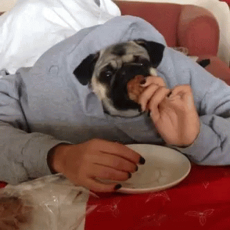

# 🐾 Pug Information Line

A Python IVR (Interactive Voice Response) application that answers your most pressing pug-related questions over the phone. The application is powered by [FastAPI](https://fastapi.tiangolo.com/) and the [Vonage Voice API](https://developer.vonage.com/en/voice/voice-api/overview).

Call a Vonage virtual number, navigate a voice menu using your keypad or your actual voice, and get information about pug history, care needs, and nearby rescue organizations.

## How It Works

### Features

- **Multimodal input**: Accepts both DTMF (dual-tone multi-frequency aka keypad) and speech input for menu navigation
- **Natural-sounding TTS**: Text-to-speech responses styled to sound more conversational (Vonage Voice API, style 11)
- **Location-aware rescue lookup**: Enter your zip code to find pug rescue organizations in your region
- **Graceful error handling**: Fallback responses and automatic re-prompt on unrecognized input

### IVR menu

```
Welcome to the Pug Information Line.

  Press 1  (or say "learn about pugs")    → Breed history & characteristics
  Press 2  (or say "pug care needs")      → Health, grooming & training tips
  Press 3  (or say "local pug rescues")   → Enter your zip code to find nearby rescues
```

### Project structure

```
.
├── main.py              # FastAPI app and webhook handlers (/answer, /event, /ivr/menu-selection)
├── vonage_handler.py    # Builds Vonage NCCO (call control) objects
├── ivr_handlers.py      # Processes DTMF/speech input and regional rescue lookup logic
├── pug_information.py   # All IVR response copy and rescue data keyed by US zip region
├── config.py            # Pydantic settings loaded from .env
├── requirements.txt     # Python dependencies
├── .env_template        # Environment variables template
└── .gitignore
```

## Prerequisites

- Python 3.8+
- A [Vonage API account](https://dashboard.nexmo.com/sign-up)
- An [ngrok account](https://ngrok.com/) and installation

## How to Get This Code Running

### 1. Set up ngrok

The Vonage Voice API needs a publicly accessible webhook URL to reach your local server. ngrok creates a secure tunnel for this.

[Install ngrok](https://ngrok.com/download), then in a separate terminal window run:

```bash
ngrok http 3000
```

Note the generated forwarding URL -- it will look like this:

```
https://your-subdomain.ngrok-free.app -> http://localhost:3000
```

### 2. Create a Vonage account and purchase a number

Sign up at the [Vonage developer dashboard](https://dashboard.nexmo.com) and purchase a virtual phone number with Voice capabilities enabled.

### 3. Create a Voice API application and link your number

1. In the dashboard, go to **Applications → Create new application**
2. Give it a name (e.g., `pug-information-line`)
3. Toggle **Voice** under Capabilities
4. Set the **Answer URL** to your ngrok URL + `/answer`:
   ```
   https://your-subdomain.ngrok-free.app/answer
   ```
5. Set the **Event URL** to your ngrok URL + `/event`:
   ```
   https://your-subdomain.ngrok-free.app/event
   ```
6. Click **Generate new application**
7. Link your purchased number to the application

### 4. Run the code

**Create and activate a Python virtual environment:**

```bash
virtualenv venv && source venv/bin/activate
```

**Install dependencies:**

```bash
pip install -r requirements.txt
```

**Configure environment variables:**

Copy `.env_template` to `.env` and fill in the values:

```bash
cp .env_template .env
```

| Variable | Description |
|----------|-------------|
| `NGROK_URL` | Your ngrok forwarding URL (e.g., `https://your-subdomain.ngrok-free.app`) |

**Start the app:**

```bash
python main.py
```

## Try It Out!

Call the Vonage virtual number you linked to the application. You should be greeted with the menu.

- **Options 1 & 2**: Hear pug breed info or care tips
- **Option 3**: Enter your 5-digit zip code on the keypad (followed by `#`) to get a list of pug rescue organizations near you

## Notes

- Rescue organization data in `pug_information.py` is hardcoded by US zip code region prefix and intended for demo use


